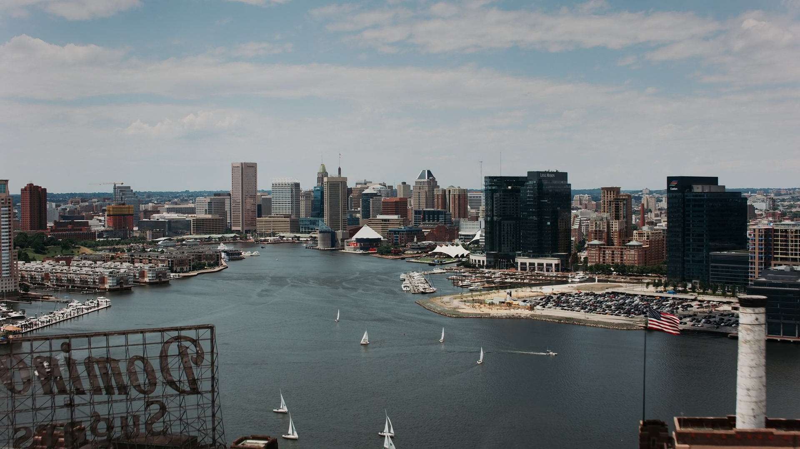

#### Challenge Description

*You're a given an aerial view of a city in US. When the construction of the tallest building of this city started?*

*flag format: `iutctf{YYYY}`*

*Author: `peace_ranger`*

---

#### Walkthrough

We are given a image. First duty is to search it in `google image search`.

Here we can see an option `See exact matches`. Let's dive into it.

We found a list.

`Chemstar Water`. Interesting. Let's see what this `Chemstar Water` is. By clicking in the `Chemstar Water` linkedIn profile, It is a leading water treatment provided based in `Middle River, Maryland, US`.

And the image that is given in the challenge, we can see a river. This is the `Middle River`. As the question mentioned about a tallest building of this city, let's search `tallest building in Maryland`.

The tallest building is the `Legg Mason Building` which is 160.934 meter tall. If you see carefully in the `city.png`, you will see the this building.

Basically the city mentioned in the question is `Baltimore` and the state is `MarryLand`.

If you click on the `Legg Mason Building`, you will see a Wikipedia link of `Transamerica Tower(Baltimore)`.

Let's click on the link.

if you scroll down a bit , you find this.

The construction started in 1971. So the flag is :

**Flag: `iutctf{1971}`**

Basically the original tower name is `Transamerica Tower`, but it's primary owner is `Legg Mason, Inc.`, which was an American Investment Management Company. You will find the history here also.

